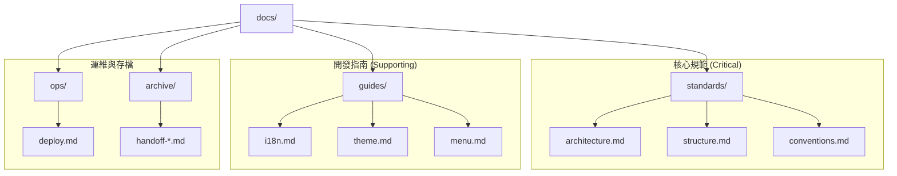

# WChoice Admin 文件庫

> 本文件庫儲存了 WChoice Admin 專案的核心架構、開發指南與歷史記錄。

## 🗺️ 文件地圖

## 📚 快速導覽

### 🔴 核心規範 (Critical)

這些文件決定了專案的整合邏輯與開發標準，所有成員必須先行閱讀：

- [**系統架構 (Architecture)**](./standards/architecture.md)：定義系統分層與技術棧選型。
- [**目錄結構 (Structure)**](./standards/structure.md)：路徑命名原則與專案佈局。
- [**AI 協作規範 (Conventions)**](./standards/conventions.md)：AI Agent 開發時的強制性檢查機制。

### 🟡 開發指南 (Supporting)

用於協助日常功能的實作與自定義：

- [**國際化 (i18n)**](./guides/i18n.md)
- [**主題與樣式 (Theme)**](./guides/theme.md)
- [**菜單與權限 (Menu)**](./guides/menu.md)

### 🔵 運維與歷史

- [**部署說明 (Deploy)**](./ops/deploy.md)
- [**交接與歷史記錄 (Archive)**](./archive/)

---

_最後更新：2026-04-14_
